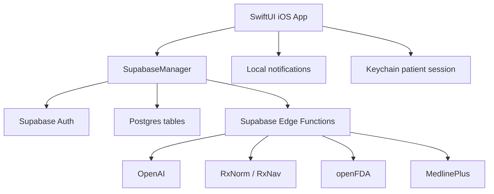

# ISTSEH

ISTSEH is an iOS medication care assistant that helps people manage medicines, daily dose timing, appointments, safety warnings, and caregiver support from one place. The product is branded in the app as **ISTSEH**, while the Xcode project and several source folders still use the earlier internal name **MEDSAI**.

The central idea is simple: medication care is not only a list of pills. It depends on the person's routine, food timing, allergies, chronic conditions, missed doses, and whether a caregiver is helping. ISTSEH brings those pieces together so a patient or caregiver can create a realistic plan, receive reminders, understand medication information, and catch obvious safety risks before saving a medication.

> Medical note: ISTSEH is designed as a medication organization and safety-support tool. It does not replace a doctor, pharmacist, or emergency medical care.

## Product Idea

Many medication apps only remind users at fixed times. ISTSEH is built around a more personal care model:

- The app asks for or stores daily routine times such as wake time, meals, and bedtime.
- Medication schedules are generated around those times, food rules, dose frequency, and minimum spacing.
- Medication details are looked up from a global catalog or source-backed AI summaries.
- Safety checks compare the user's current medicines with active ingredients, allergies, and known interaction rules.
- Caregivers can create and manage patient profiles, connect patients with a short care code, and control patient permissions.
- Patients can use the app through normal account login or through a caregiver-generated family code.

In short, ISTSEH is intended to be a personal medication assistant for individuals and a lightweight care coordination tool for families.

## Main Users

| User type | Purpose |
| --- | --- |
| Regular user | Manages their own medications, appointments, routine, reminders, and medical profile. |
| Caregiver | Creates or manages family member profiles, switches between patients, controls permissions, and monitors schedules. |
| Patient linked by code | Uses a caregiver-created patient profile through a secure device-token session without needing a full email/password account. |

## Core Features

### Smart medication scheduling

ISTSEH creates dose times using:

- Wake time and bedtime.
- Breakfast, lunch, and dinner times.
- Medication frequency per day.
- Food timing rules: before food, with food, after food, or no food rule.
- Minimum interval between doses when available.
- Explicit manual dose times when the user confirms or edits suggested times.
- PRN/as-needed medications, which are stored without fixed automatic reminders.

The scheduling logic lives mainly in `MEDSAI/Utilities/Helpers.swift` under the `Scheduler` type.

### Medication management

The Meds tab supports:

- Viewing the user's active medications.
- Adding a medication manually.
- Fetching medication information as the user types.
- Choosing known dosage strengths when available.
- Editing and deleting medication records.
- Archiving/restoring behavior through active state handling.
- Viewing medication details.
- Pull-to-refresh from Supabase.
- Safety warning badges on medication rows.

Medication data is represented in the app by `LocalMed` and stored in Supabase through `user_medications` linked to the global `medications` catalog.

### AI-assisted medication information

The app can fetch medication information through the `drug-intel` Supabase Edge Function. That function:

- Normalizes a medication name to RxCUI through RxNorm.
- Pulls source material from openFDA and MedlinePlus.
- Caches source responses in `drug_source_cache`.
- Generates a concise JSON summary with OpenAI.
- Caches summaries in `drug_ai_summary_cache`.

The app also has an openFDA fallback path in `MEDSAI/Utilities/OpenFDA.swift` for labels, dosage information, ingredients, interactions, warnings, and side effects.

### Search

The Search tab supports:

- Searching medication names from the Supabase medication catalog.
- Falling back to source-backed AI medication details when a catalog result is missing.
- Showing usage, how-to-take notes, side effects, interaction notes, strengths, food rules, and source/cached badges.
- Saving recent searches in `search_history`.

### Photo-based medication recognition

ISTSEH includes a photo upload flow:

- User selects a medication image from Photos.
- Image is compressed and sent to the `image-to-drug` Edge Function.
- OpenAI vision returns up to three medication candidates with confidence, strength, dosage form, and detected text.
- User confirms or edits the candidate before any medication is saved.
- Confirmed candidate is used to fetch full medication details before opening the add-medication flow.

The camera capture utility exists, but the current Meds menu camera action is still a placeholder. Photo upload is implemented; live camera capture is not fully wired into the Meds menu yet.

### Schedule instruction parsing

When adding a medication, users can paste label or doctor instructions in English or Arabic. The `parse-schedule` Edge Function tries deterministic parsing first and then uses OpenAI if needed. It can return:

- Dose amount.
- Dose unit.
- Frequency per day.
- Interval hours.
- Times of day.
- Food rule.
- As-needed flag.
- Confidence and confirmation requirement.

The app always asks the user to confirm suggested times before saving.

### Safety checking

Safety checking is one of the core parts of ISTSEH. Before saving a medication, the app sends the new medication plus current active medications to the `check-interactions` Edge Function.

Implemented safety checks include:

- Duplicate active ingredient detection.
- Allergy conflict detection using patient allergies and class/alias maps.
- Interaction lookup from the `interaction_rules` table.
- RxNav fallback for drug-drug interaction pairs when RxCUI values are available.
- Patient-friendly warning text simplification when OpenAI is configured.
- Local offline fallback through `InteractionEngine` if the server check fails.
- Warning severity handling: contraindicated, major, moderate, minor, unknown.
- Blocking behavior for contraindicated or non-continuable warnings.

Patient chronic conditions are already stored and sent through the profile system. The current backend records condition presence in the safety trace, but a full condition-specific rule engine is not finished yet.

### Today view and adherence tracking

The Today tab shows:

- Today's appointments.
- Today's scheduled medication doses.
- Doses generated from the user's active medications and routine.
- Checkmarks for completed appointments and doses.
- Context menu action to skip a dose.
- Dose event sync to Supabase through `medication_dose_events`.

Dose completion is stored locally for immediate UI feedback and synced to the backend for taken/skipped events.

### Calendar and appointments

The Calendar tab supports:

- Monthly calendar selection.
- Per-day appointment list.
- Per-day dose list.
- Add, edit, and delete appointment flows.
- Appointment reminders at bedtime the day before and 30 minutes before.
- Patient-scoped appointment access through the `patient-medications` Edge Function when in caregiver or care-code mode.

### Reminders and notifications

The notification layer supports:

- Medication reminders for the next 7 days based on stored dose times.
- Appointment reminders.
- Notification actions for marking a dose as taken.
- Per-context reminder preferences, scoped to self, patient, or managed profile.
- Automatic reminder refresh when routine settings change.

Missed-dose follow-up and caregiver push alerts are part of the intended product direction, but they are not fully implemented yet. There are early hooks for follow-up IDs and durable dose events, but no complete escalation workflow.

### Medical profile

The Settings area includes a medical profile for:

- Allergies.
- Allergy severity, reaction, and notes.
- Chronic conditions.
- Condition status and notes.
- Add, edit, and archive/deactivate flows.
- Preset catalogs plus custom entries.
- Patient-context support for regular users, caregivers, and code-linked patients.

Profile operations go through the `patient-profile` Supabase Edge Function.

### Caregiver and family support

Caregiver support currently includes:

- Creating a family member/patient profile.
- Adding initial allergies and chronic conditions.
- Setting initial permissions for medication and calendar management.
- Generating a 6-digit care code.
- Redeeming the care code from a patient device.
- Storing a patient device-token session in Keychain.
- Switching between "My Profile" and managed family members.
- Updating patient permissions.
- Transferring a patient to another caregiver.
- Removing a family member.
- Listing and revoking linked patient devices.

The care-code flow has been hardened with hashed codes, expiration, device session creation, patient device records, and audit logging.

## Screens Implemented So Far

| Area | Current state |
| --- | --- |
| Landing | ISTSEH landing screen with sign up, login, and family code entry. |
| Authentication | Supabase email/password sign up, login, password reset, and profile creation. |
| Care code entry | 6-digit code input, redemption, device-token session storage. |
| Today | Today's appointments and doses, completion toggles, dose event sync. |
| Calendar | Calendar picker, appointments, doses for selected day. |
| Meds | Medication list, add/edit/delete, photo upload, warnings, detail sheet. |
| Search | Catalog search, AI fallback, recent searches, details navigation. |
| Settings | Profile header, routine, reminders, medical profile, family, language, appearance, sign out. |
| Medical profile | Allergies and chronic conditions with add/edit/archive flows. |
| Family settings | Family member list, add member, permissions, transfer, remove. |
| Device management | Linked patient device listing and revocation. |

## Architecture



### iOS app

- Native SwiftUI app.
- Main project: `MEDSAI.xcodeproj`.
- App entry: `MEDSAI/App/MediScheduleApp.swift`.
- Navigation shell: `MEDSAI/App/RootView.swift` and `MEDSAI/App/RootTabView.swift`.
- Shared app state: `AppSettings`.
- Data repositories: `UserMedsRepo`, `AppointmentsRepo`, `SearchHistoryRepo`.
- Local notifications: `NotificationsManager`.
- Patient session storage: `PatientSessionStore` backed by Keychain.

### Backend

Supabase is the main backend. The app uses:

- Supabase Auth for regular and caregiver accounts.
- Supabase Postgres for users, medications, appointments, medical profiles, family links, device sessions, audit logs, and dose history.
- Supabase Edge Functions for privileged patient-scoped operations and AI workflows.
- Row Level Security and service-role functions for sensitive caregiver/patient operations.

There is also a Firebase Cloud Function under `functions/src/index.ts`. It appears to be an older or legacy `drugIntel` implementation, while the current app paths use the Supabase Edge Function version.

## Supabase Edge Functions

| Function | Purpose |
| --- | --- |
| `drug-intel` | Source-backed AI medication summary using RxNorm, openFDA, MedlinePlus, and OpenAI. |
| `image-to-drug` | Medication image candidate recognition from a base64 image. |
| `parse-schedule` | English/Arabic medication instruction parsing into structured schedule fields. |
| `check-interactions` | Duplicate ingredient, allergy, interaction-rule, and RxNav safety checks. |
| `patient-profile` | Patient allergies, conditions, and routine read/write actions. |
| `patient-medications` | Patient-scoped medication and appointment CRUD for caregiver/code sessions. |
| `create-family-member` | Caregiver creates a patient profile, relation, and redeemable care code. |
| `redeem-care-code` | Patient redeems a care code and receives a device-token session. |
| `list-patient-devices` | Caregiver reads a redacted list of linked patient devices. |
| `revoke-patient-device` | Caregiver revokes a patient device. |
| `transfer-patient` | Moves a patient relation to another registered caregiver. |

## Database Highlights

Important tables and concepts:

- `users`: account/profile data, role, routine times, allergies/conditions legacy arrays.
- `medications`: global medication catalog and cached medication metadata.
- `user_medications`: patient-specific medication plan records.
- `appointments`: patient appointments.
- `search_history`: recent medication searches.
- `caregiver_relations`: caregiver-to-patient links, status, and permissions.
- `care_codes`: generated family codes with status, expiration, hash, attempts, and lock support.
- `device_sessions`: legacy/current patient device-token sessions.
- `patient_devices`: hardened device tracking with revocation support.
- `patient_allergies`: structured patient allergy records.
- `patient_conditions`: structured chronic condition records.
- `interaction_rules`: deterministic interaction rules used before RxNav fallback.
- `drug_source_cache`: public source cache for official drug data.
- `drug_ai_summary_cache`: public AI summary cache.
- `audit_logs`: service-role audit trail for care codes, devices, safety, and profile changes.
- `medication_dose_events`: durable taken/skipped/missed dose event history.
- `medication_schedules`: backend foundation for richer schedule persistence.

## Implementation Status

### Completed or mostly working

- SwiftUI app shell and custom ISTSEH tab navigation.
- Supabase Auth sign up, login, password reset, and profile creation.
- Caregiver family member creation with generated care code.
- Care-code login for patient devices.
- Keychain-backed patient session persistence.
- Patient/caregiver context switching.
- Medication CRUD with Supabase persistence.
- Appointment CRUD with Supabase persistence.
- Routine settings with debounced Supabase save.
- Smart dose scheduling around routine and food rules.
- Local medication and appointment reminders.
- Today and Calendar dose generation.
- Taken/skipped dose event writes.
- Medication search and details.
- Drug information lookup through Supabase Edge Functions with openFDA fallback.
- Photo upload medication recognition and confirmation.
- Schedule parsing from natural language instructions.
- Medical profile screens for allergies and chronic conditions.
- Server-side safety check for duplicates, allergies, interaction rules, and RxNav.
- Offline/local interaction fallback for basic safety warnings.
- Device listing and revocation backend/client flow.
- Audit logging foundation.
- ISTSEH visual theme files and reusable SwiftUI components.

### In progress or not fully finished

- Live camera capture is not wired from the Meds menu yet.
- Missed-dose follow-up reminders are not complete.
- Caregiver push alerts for missed doses or serious warnings are not complete.
- Condition-specific medication safety rules are not complete.
- Safety-warning acknowledgement logging is marked as TODO in the add-medication flow.
- Privacy policy, terms, and support links are placeholders.
- Some older Firebase/working files remain alongside the newer Supabase implementation.
- Some database policies and migrations show an evolution from permissive development access toward hardened RLS; review them before production use.
- The codebase still contains both MEDSAI and ISTSEH naming while the product branding settles.

## Repository Structure

```text
.
|-- MEDSAI/                         # Main SwiftUI iOS app source
|   |-- App/                        # App entry, root routing, tab shell
|   |-- Auth/                       # Landing, login, sign up, care code entry
|   |-- Today page/                 # Today schedule and adherence UI
|   |-- Calendar page/              # Calendar, appointments, schedule view
|   |-- Meds page/                  # Medication list, add/edit/detail/scan flows
|   |-- SearchPage/                 # Medication search and history
|   |-- Settings page/              # Profile, routine, reminders, family, devices
|   |-- Services/                   # Supabase, Keychain, patient session storage
|   |-- Utilities/                  # Scheduling, safety, parsing, theme, shared UI
|   `-- docs/                       # Earlier requirements document
|-- supabase/
|   |-- functions/                  # Deno Edge Functions
|   |-- migrations/                 # Postgres migrations
|   `-- schema_public.sql           # Exported public schema snapshot
|-- functions/                      # Firebase Cloud Function legacy/alternate backend
|-- ASSETS/                         # ISTSEH presentation and brand assets
|-- server.js                       # Small web overview page for Replit/browser preview
`-- MEDSAI.xcodeproj                # Xcode project
```

## Running the iOS App

1. Open `MEDSAI.xcodeproj` in Xcode.
2. Select the `MEDSAI` scheme.
3. Choose an iOS simulator or device.
4. Build and run.

The main app target is configured for a recent iOS deployment target in the Xcode project. The app uses Swift Package Manager dependencies, including `supabase-swift`, Firebase packages, Google Sign-In packages, and supporting Swift libraries.

## Backend Setup Notes

The current app points to a Supabase project through `MEDSAI/Services/SupabaseManager.swift`. For another environment, update the Supabase URL and publishable key there.

Supabase Edge Functions expect secrets such as:

- `SUPABASE_URL`
- `SUPABASE_ANON_KEY`
- `SUPABASE_SERVICE_ROLE_KEY`
- `OPENAI_API_KEY`
- `CARE_CODE_PEPPER`

Typical deployment flow:

```bash
supabase db push
supabase functions deploy drug-intel
supabase functions deploy image-to-drug
supabase functions deploy parse-schedule
supabase functions deploy check-interactions
supabase functions deploy patient-profile
supabase functions deploy patient-medications
supabase functions deploy create-family-member
supabase functions deploy redeem-care-code
supabase functions deploy list-patient-devices
supabase functions deploy revoke-patient-device
supabase functions deploy transfer-patient
```

The Firebase function in `functions/` can be built with:

```bash
cd functions
npm install
npm run build
```

## Optional Web Overview

This repository includes `server.js`, a small static documentation/overview server used by the Replit workflow. It is not the app itself. The actual product is the native iOS project.

```bash
node server.js
```

Then open `http://localhost:5000`.

## Safety and Production Notes

Before treating ISTSEH as production-ready, review:

- Medical disclaimer and UX copy.
- Clinical validation of safety rules and medication summaries.
- RLS policies and anonymous access grants.
- Secrets handling and environment separation.
- Push notification strategy for caregiver escalation.
- Audit retention and privacy requirements.
- Real privacy policy, terms, and support URLs.
- App Store privacy labels and permission text.

## Current Product Summary

ISTSEH is already a functional iOS prototype with a real SwiftUI interface, Supabase persistence, medication scheduling, reminders, medication search, AI-assisted drug information, image-based medication recognition, structured safety checks, medical profiles, and caregiver/patient linking.

The strongest implemented parts are medication CRUD, smart scheduling, patient/caregiver context, care-code access, profile-backed safety checks, and source-backed medication information. The main remaining work is production hardening, live camera wiring, missed-dose escalation, caregiver push alerts, and deeper condition-aware safety logic.
